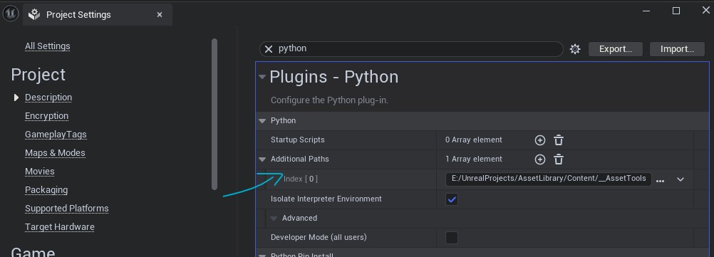
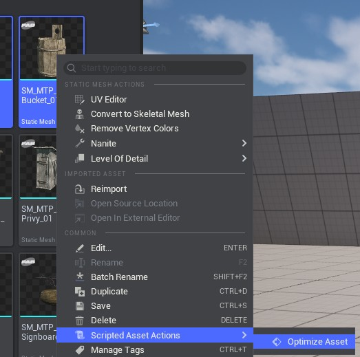
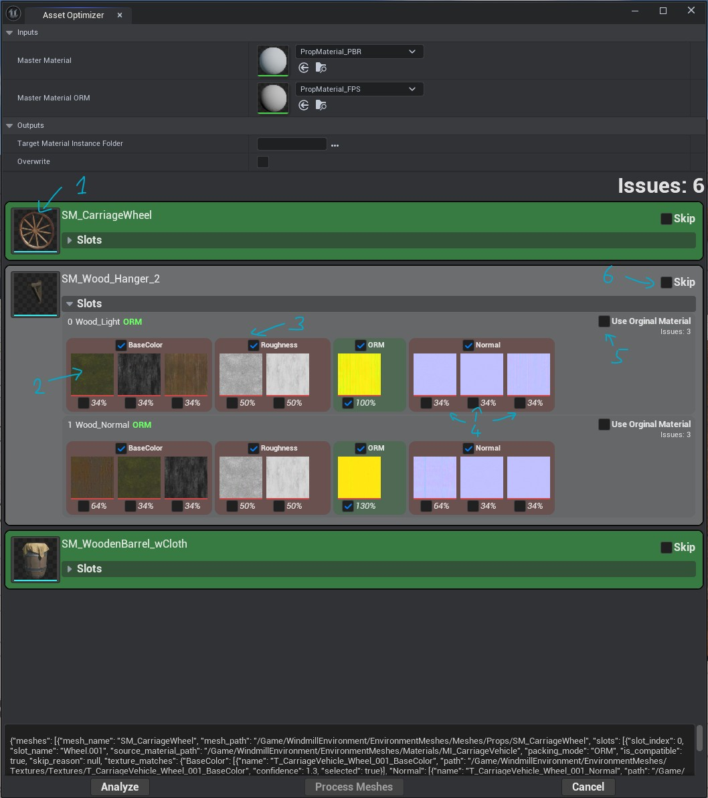

# Material Optimizer

An Unreal Engine Editor Utility for batch-creating optimized Material Instances from static mesh materials. Analyzes texture dependencies, creates MIs parented to a master material, and assigns textures automatically.

## Disclaimer
This is a tool I use for myself, in conjunction with the [Dash](https://www.polygonflow.io/) plugin master materials, howver it can work with any master
material as long as the name of the parameters are somhow conventional (see the MATERIAL_PARAMETER_NAMES dict in materiaoptimizer.py).

This tool is given as is, under MIT license, you can do whatever you want with it, but I may drop maintenance any time if I don't need it anymore

## Why?
If you bought / got for free a lot of assets packs on fab or anywhere else, you may have, like I do, hundreds of them.

Each pack comes with its own master material(s) and when you use the assets in a scene you will end up with hundreds of materials to compile x plenty eventual shader permutation for each one of them.
This will make the shader compilation time skyrocket and may introduce the dreaded micro freeze of unreal.

Also when you want to add some variations to the materials, like snow / wetness /rain (what the dash plugin provides in its stock materials), you'd have to modify everyone of your hundreds materials to support it and adding again a lot more shader permutations.

This tool aims at reducing this issue by converting any assets to use the same master material (or few master materials) in few click.

**It's not magic**, as some materials will be too complex or specific to convert them. But most of the time you will drastically reduce the number of shaders to compile using this tool.

## Features

- Batch process multiple static meshes from Content Browser selection
- Automatic texture discovery from material dependencies
- Confidence-based texture matching using naming heuristics
- Support for ORM/ARM packed texture workflows
- Two-phase workflow: analyze first, then process with user validation
- Visual UI for reviewing and resolving texture conflicts
- Blueprint-callable functions via `@unreal.ufunction()`

## Installation

### Prerequisites
- Unreal Engine Python Plugin enabled
- Plugin dependency: **Json Blueprint Utilities**

### Setup
1. Place folder contents in `Content/__AssetTools` (or your preferred location)
2. Add the path to `Config/DefaultEngine.ini`:
```ini
[/Script/PythonScriptPlugin.PythonScriptPluginSettings]
+AdditionalPaths=(Path="Content/__AssetTools")
```
(you may need to use the absolute path from the root of the hard drive)\
Alternatively you can configure this in the Project settings, search for "Python" and add an entry in the "Additional Paths" array

4. Restart the editor to load Python modules

## Usage

1. Select one or more Static Meshes in the Content Browser
2. Right-click and choose **Scripted Asset Actions > Optimize Assets**
   
3. In the popup:
   - Configure master material paths
   - Click on "Analyze"
   - Review analyzed meshes and their texture assignments
   - Resolve any conflicts (multiple textures matching same channel)
   - Skip channels or meshes as needed
    
         1. Click on the mesh thumbnail to open the mesh editor   
         2. Click on the texture thumbnail to open the texture editor \
         3. Click on a chanel check box to disable it (skipped during processing) \
         4. Pick on of the proposed textures. the % is the "confidence" level of the tool that this is the right texture. It can go over 100% in which case you ca be pretty sure it' sthe right one.\
         5. You can decide to keep the origial material for a given material slot (if the material is too complex, you may not be able to cnvert it)\
         6. You can decide to skip the whole static mesh if materials are too complex\
         The console at the bottom displays the processing json, it's just a convenient debugging comodity.
4. Click **Process** to create Material Instances

## File Structure

### Python Modules

| File | Class | Purpose |
|------|-------|---------|
| `material_optimizer.py` | `BPMaterialOptimizer` | Core logic for material analysis and MI creation |
| `json_library.py` | `BPJsonLibrary` | JSON manipulation utilities for Blueprint |
| `init_unreal.py` | - | Module loader (imports both libraries) |

### Blueprint Assets

| Asset | Type | Purpose |
|-------|------|---------|
| `AAU_MaterialAssigner` | Asset Action Utility | Context menu integration |
| `EUW_MaterialAssignerPopup` | Editor Utility Widget | Main popup UI |
| `EUW_MeshEntry` | Editor Utility Widget | Mesh row display |
| `EUW_MaterialSlotEntry` | Editor Utility Widget | Material slot display |
| `EUW_Channel` | Editor Utility Widget | Texture channel display |
| `BP_JsonListEntry` | Blueprint | JSON list item handling |

## Blueprint Nodes

The Python classes expose Blueprint-callable functions under their respective categories:

### Material Optimizer (Category: "Material Optimizer")

**Analyze Selected Meshes**
- Analyzes Content Browser selected meshes
- Returns JSON with texture candidates, conflicts, and confidence scores
- Read-only operation (no asset modifications)

**Optimize Materials From Analysis**
- Takes analysis JSON and creates Material Instances
- Assigns textures to MI parameters
- Assigns MIs to mesh material slots

### JSON Utils (Category: "JSON Utils")

- `Set String/Bool/Int/Float Json Value` - Set values at JSON paths
- `Get Json Value` - Get values from JSON paths
- `Append To Json Array` - Add items to arrays
- `Remove From Json Array` - Remove items from arrays

Path syntax: `meshes[0].slots[1].skipped_channels.BaseColor`

## Texture Packing Support

| Format | Channel Order | Status |
|--------|--------------|--------|
| ORM/ARM | Occlusion(R), Roughness(G), Metallic(B) | Supported |
| RMA | Roughness(R), Metallic(G), AO(B) | Skipped (incompatible) |
| RAM | Roughness(R), AO(G), Metallic(B) | Skipped (incompatible) |

## Confidence Scoring

Textures are scored for auto-selection:
- **Base confidence**: 1.0 if single match, else 1.0 / num_candidates
- **Name bonus**: +0.3 if texture name contains mesh/material/slot name
- Textures with confidence >= 1.0 are auto-selected
- Results sorted by confidence (highest first)

## Analysis JSON Structure

```json
{
  "total_issues": 0,
  "meshes_with_conflicts": 0,
  "can_auto_process": true,
  "meshes": [
    {
      "mesh_name": "SM_Chair",
      "mesh_path": "/Game/Meshes/SM_Chair",
      "total_issues": 0,
      "skip": false,
      "slots": [
        {
          "slot_index": 0,
          "slot_name": "Wood",
          "source_material_path": "/Game/Materials/M_Wood",
          "packing_mode": "STANDARD",
          "is_compatible": true,
          "total_issues": 0,
          "texture_matches": {
            "BaseColor": [
              {"name": "T_Wood_BaseColor", "path": "...", "confidence": 1.3, "selected": true}
            ]
          },
          "skipped_channels": {"BaseColor": false, "Normal": false}
        }
      ]
    }
  ]
}
```

## Notes

- Static meshes are NOT auto-saved after material assignment
- Save meshes manually (Ctrl+Shift+S) to persist changes
- Existing Material Instances can be reused or overwritten (configurable)
